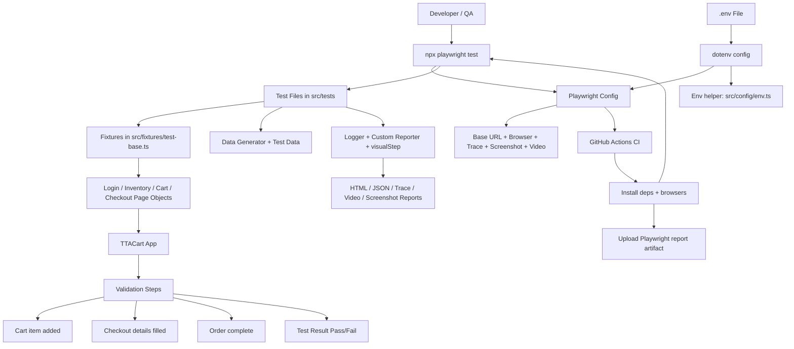

# Advance Playwright Framework 2X

A practical Playwright + TypeScript automation framework for UI testing. This project is designed for a shopping application flow, with page objects, reusable fixtures, environment-based configuration, test data utilities, reporting, and CI support.

This README explains what the project does, how it is organized, how to run tests, and how to configure it for local and CI execution.

## Eli5: what this project is doing

Think of this project like a robot that opens the app in a browser, clicks around like a real user, and checks whether important things work.

- It opens the login page
- logs in with test data
- adds a product to the cart
- goes through checkout
- verifies the order is completed

Instead of writing the same browser steps over and over, the project uses a structure called Page Object Model. That means each page in the app has its own class with methods like `loginAs()`, `addToCart()`, and `checkout()`. This keeps the tests short, readable, and easier to maintain.

In simple words: it helps the team automate app testing without writing messy, duplicate browser code.

## What this project does

The framework automates e2e flows for a test application called TTACart. It covers:

- login and invalid login scenarios
- inventory page actions
- cart flows
- checkout step one and step two
- order completion validation
- reusable app-state fixtures for login and checkout setup

The code is structured around the Page Object Model (POM), which keeps browser actions and selectors in page classes instead of scattering them across test files.

## Tech stack

- Playwright Test
- TypeScript
- Node.js
- dotenv for .env file handling
- Faker for generated data
- Winston for logging
- AJV + ajv-formats for validation
- custom HTML and list reporters

## Project structure

```text
.
├── .github/
│   └── workflows/
│       └── playwright.yml          # CI workflow for GitHub Actions
├── docs/                           # Project documentation
├── rules/                          # Project rules and conventions
├── src/
│   ├── api/                        # API layer (if used by the project)
│   ├── config/
│   │   ├── credentials.ts          # Shared credentials used in tests
│   │   ├── env.ts                 # .env loader and env helpers
│   │   └── env.ts                 # env utilities (read/require/validate)
│   ├── fixtures/
│   │   └── test-base.ts           # Playwright custom fixtures and app-state setup
│   ├── pages/
│   │   ├── BasePage.ts            # Shared page logic and navigation
│   │   ├── LoginPage.ts
│   │   ├── InventoryPage.ts
│   │   ├── CartPage.ts
│   │   ├── CheckoutStepOnePage.ts
│   │   ├── CheckoutStepTwoPage.ts
│   │   ├── CheckoutCompletePage.ts
│   │   └── ItemDetailPage.ts
│   ├── testdata/
│   │   ├── login.data.ts
│   │   ├── logintestdata.json
│   │   └── Schemas/
│   ├── tests/
│   │   ├── e2e/
│   │   ├── login/
│   │   └── ...
│   └── utils/
│       ├── CustomReporter.ts
│       ├── DataGenerator.ts
│       ├── logger.ts
│       ├── UtilElementLocator.ts
│       └── visualStep.ts
├── .env                            # Local env values; ignored by Git
├── .gitignore
├── package.json
├── playwright.config.ts           # Playwright main config
├── tsconfig.json
├── playwright-report/             # HTML report output
├── test-results/                  # Run artifacts (videos, screenshots, traces)
├── tta-report/                    # Custom generated reports
├── README.md
└── package-lock.json
```

## Requirements

Before running the tests, install the following:

- Node.js LTS
- npm
- Git
- Playwright browsers

## Installation

Clone the repository:

```bash
git clone <repo-url>
cd AdvancePlaywrightFramework2x
```

Install dependencies:

```bash
npm install
```

Install Playwright browser binaries:

```bash
npx playwright install
```

For Linux or CI environments:

```bash
npx playwright install --with-deps
```

## Environment configuration

This project uses a local `.env` file in the root folder. It should not be committed to source control because it may contain credentials and environment-specific values.

Create a `.env` file in the root of the project with the values below:

```env
TTA_ENV=qa
BASE_URL=https://app.thetestingacademy.com
QA_BASE_URL=https://app.thetestingacademy.com
STG_BASE_URL=https://stage.thetestingacademy.com
PROD_BASE_URL=https://app.thetestingacademy.com
DEV_BASE_URL=http://localhost:3000
API_BASE_URL=https://restful-booker.herokuapp.com
LOG_LEVEL=info
ATTACH_SCREENSHOTS=true
TEST_ENV=QA
TEST_AUTHOR=Your Name
STANDARD_USER=standard_user
TTA_SECRET=tta_secret
USERNAME=standard_user
PASSWORD=tta_secret
CHECKOUT_ITEM_ID=test-allthethings-tshirt-red
CHECKOUT_FIRST_NAME=John
CHECKOUT_LAST_NAME=Doe
CHECKOUT_POSTAL_CODE=560001
```

Important notes:

- `playwright.config.ts` loads these values using `dotenv`
- `BASE_URL` is resolved from environment values automatically
- this project keeps local credentials in `.env` and uses secrets in GitHub Actions for CI

## How env values are handled

The project already includes a helper layer in [src/config/env.ts](src/config/env.ts).

That file provides utilities such as:

- `requireEnv(key)`
- `envOr(key, fallback)`
- `assertEnv(...)`

These helpers make it easier to fail fast when required values are missing, instead of letting the test fail later in a confusing way.

## Running tests

Run all tests:

```bash
npx playwright test
```

Run a specific file:

```bash
npx playwright test src/tests/e2e/e2e-checkout.spec.ts
```

Run a specific project/browser:

```bash
npx playwright test --project=chromium
```

Run in headed mode (browser visible):

```bash
npx playwright test --headed
```

Run tests matching a title:

```bash
npx playwright test -g "logs in using values from .env"
```

Run the TypeScript checker:

```bash
npx tsc --noEmit
```

Open the HTML report:

```bash
npx playwright show-report
```

Open the trace viewer:

```bash
npx playwright show-trace
```

Open a specific trace zip:

```bash
npx playwright show-trace "test-results/<folder>/trace.zip"
```

## Playwright configuration overview

The main config lives in [playwright.config.ts](playwright.config.ts). It controls:

- test directory
- test timeout and assertion timeout
- parallelism and worker count
- HTML + list reporters
- browser type and device settings
- base URL resolution
- screenshots, video, and trace capture

Current config highlights:

- uses Chromium
- runs in headless mode in CI
- captures screenshots, video, and traces
- uses one worker for stability in this project

## Fixtures and reusable setup

The framework uses custom fixtures in [src/fixtures/test-base.ts](src/fixtures/test-base.ts).

This file defines ready-made app states such as:

- invalidLogin
- validLogin
- loginWithInventory
- loginWithSelectedItem
- checkoutReady

This is helpful because tests can get a preconfigured state without repeating login or setup steps in every spec.

Example concept:

```ts
test('should complete checkout with a preselected item fixture', async ({ loginWithSelectedItem, cartPage }) => {
    // the app is already in the right state
});
```

## Page Object Model structure

The application pages are wrapped in classes under [src/pages](src/pages). Each page class contains:

- selectors for the page elements
- methods for actions like click, type, navigate, and validate
- assertion helpers like `assertLoaded()`

### Base page concept

[BasePage.ts](src/pages/BasePage.ts) holds common logic such as:

- page reference
- element utilities
- logger setup
- navigation helper

Child pages inherit these features. That reduces duplication and keeps test code cleaner.

## Test data and utilities

### DataGenerator

The data utility in [src/utils/DataGenerator.ts](src/utils/DataGenerator.ts) generates realistic customer and checkout values for tests.

### Logger

The project uses Winston in [src/utils/logger.ts](src/utils/logger.ts) to provide structured logs.

### Custom reporter

[CustomReporter.ts](src/utils/CustomReporter.ts) adds custom reporting behavior and environment details to the test output.

### visualStep utility

[visualStep.ts](src/utils/visualStep.ts) is used to log and visually break up test flows so the execution is easier to read and debug.

## Reports and artifacts

When the project runs, Playwright generates artifacts such as:

- HTML reports in `playwright-report/`
- traces in `test-results/**/trace.zip`
- screenshots in `test-results/**`
- videos in `test-results/**`

These artifacts are useful for debugging failure cases and for reviewing step-by-step execution.

## GitHub Actions CI

The CI workflow is defined in [.github/workflows/playwright.yml](.github/workflows/playwright.yml).

The workflow does the following:

1. checks out the repository
2. installs Node.js
3. runs `npm ci`
4. installs Playwright browsers with OS dependencies
5. runs the Playwright suite
6. uploads the HTML report as an artifact

For this project, CI must also receive env secrets for values such as:

- `STANDARD_USER`
- `TTA_SECRET`
- `CHECKOUT_ITEM_ID`
- `CHECKOUT_FIRST_NAME`
- `CHECKOUT_LAST_NAME`
- `CHECKOUT_POSTAL_CODE`

This is required because the .env file is local and intentionally excluded from Git.

## Project conventions and best practices

Follow these patterns when adding new code to the project:

- keep selectors and actions in page objects under [src/pages](src/pages)
- keep test logic in [src/tests](src/tests)
- reuse fixtures instead of duplicating setup
- store credentials and secrets in `.env` or GitHub secrets, not in source code
- use `assertEnv` or `requireEnv` when env values are mandatory
- keep test names readable and business-focused
- run the relevant spec before merging a change

## Useful commands

```bash
# install project dependencies
npm install

# install Playwright browsers
npx playwright install

# run all tests
npx playwright test

# run a specific spec
npx playwright test src/tests/e2e/e2e-checkout-env.spec.ts

# run a specific browser/project
npx playwright test --project=chromium

# run in headed mode
npx playwright test --headed

# show report
npx playwright show-report

# show trace viewer
npx playwright show-trace

# type-check the codebase
npx tsc --noEmit
```

## License

This project currently declares the ISC license in [package.json](package.json).

## Simple OOP explanation for this project

This framework follows the Page Object Model, which is a common OOP design pattern.

### 1. Class
Classes are used to represent pages.

Examples:

- `LoginPage`
- `InventoryPage`
- `CartPage`
- `CheckoutStepOnePage`

Each class is a blueprint for one page in the application.

### 2. Inheritance
The base class [BasePage.ts](src/pages/BasePage.ts) contains shared logic, and page-specific classes inherit it.

This means common logic such as navigation or page waits is written once and reused.

### 3. Encapsulation
Page selectors and page actions are wrapped inside the page class. Tests call a method such as `loginAs()` or `addToCart()` instead of writing raw browser steps repeatedly.

### 4. Reusability
The same page object logic can be reused by many tests, which reduces code duplication and makes maintenance easier.

### 5. Abstraction
The tests stay readable because they do not need to know the internal selectors or implementation details of the page. They just call high-level methods.

## Final note

This framework is built for maintainability and test reuse. The project separates concerns clearly:

- page code goes in [src/pages](src/pages)
- app states go in [src/fixtures](src/fixtures)
- environment logic goes in [src/config](src/config)
- test scenarios go in [src/tests](src/tests)
- helpers go in [src/utils](src/utils)

This makes the project easier to scale as more flows, pages, and data scenarios are added.

## Architecture diagram for the team



This flow shows the main idea of the framework: configuration and environment values feed the tests, the tests use reusable fixtures and page objects, and the results are reported back with screenshots, traces, and CI artifacts.

## Checkout flow diagram

```mermaid
flowchart LR
    A[Open Login Page] --> B[Login with env credentials]
    B --> C[Open Inventory Page]
    C --> D[Select Product]
    D --> E[Add to Cart]
    E --> F[Open Cart]
    F --> G[Proceed to Checkout]
    G --> H[Fill Customer Details]
    H --> I[Review Order]
    I --> J[Finish Checkout]
    J --> K[Order Complete Page]
    K --> L[Test Pass / Fail result]
```



This is the typical happy-path journey covered by the checkout automation in this project.
